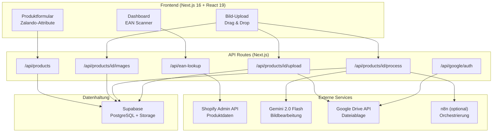
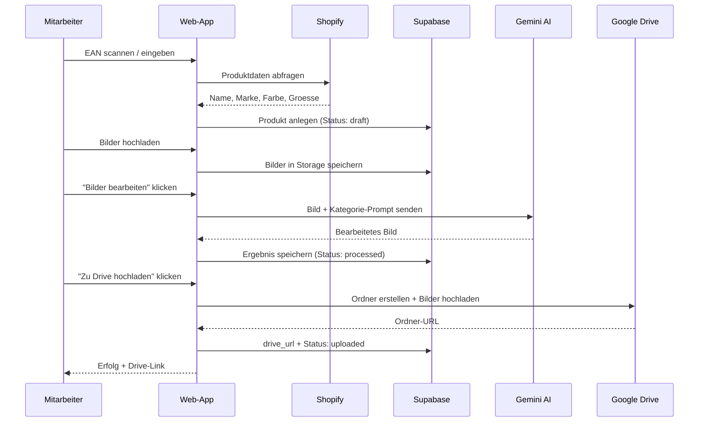
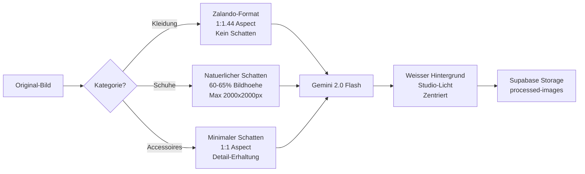
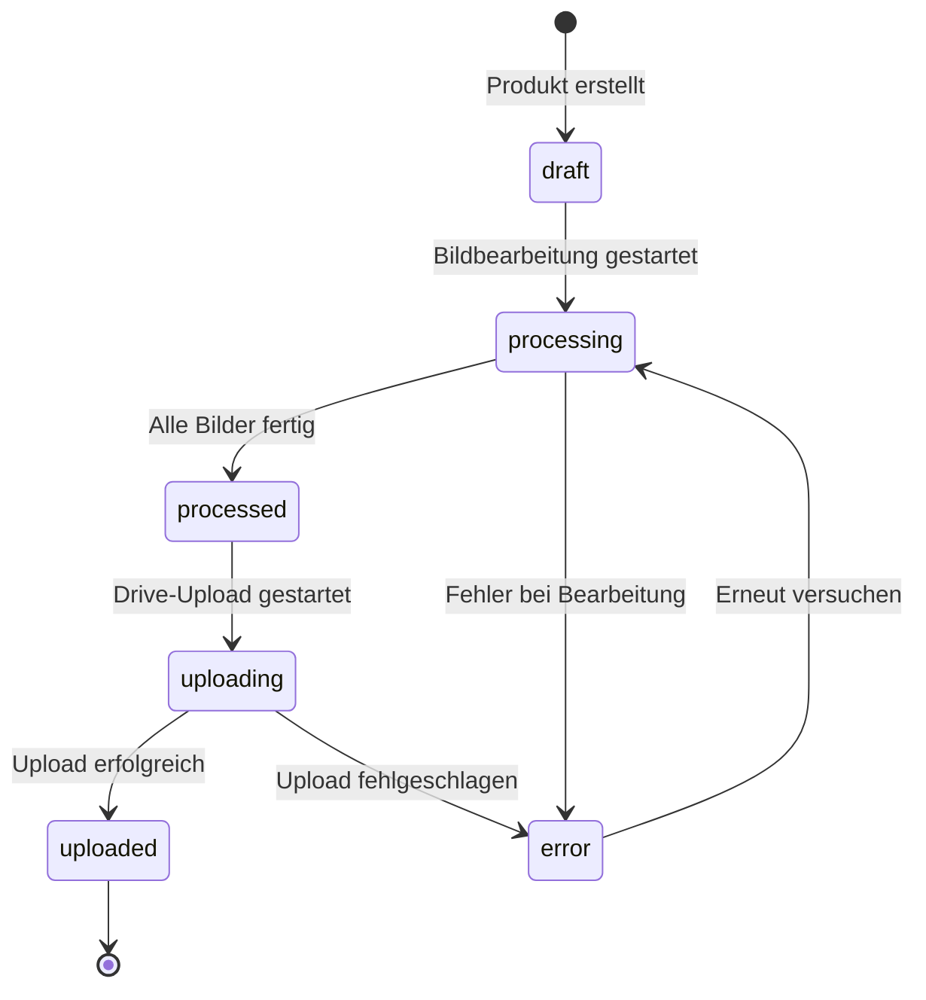

# SPZ Produkt-Upload Tool

Web-App zur strukturierten Erfassung, KI-Bildbearbeitung und automatischen Google-Drive-Ablage von Produktdaten. Optimiert fuer Zalando-Attribute und Shopify-Integration.

---

## Architektur



## Produkt-Workflow



## Bildbearbeitungs-Pipeline



## Produkt-Status



---

## Tech-Stack

| Komponente | Technologie |
|---|---|
| Frontend | Next.js 16, React 19, Tailwind CSS 4 |
| Backend | Next.js API Routes (Serverless) |
| Datenbank | Supabase (PostgreSQL + Storage) |
| Bildbearbeitung | Gemini 2.0 Flash (KI) |
| Cloud-Ablage | Google Drive API + OAuth2 |
| Produktdaten | Shopify Admin API (GraphQL + REST) |
| Authentifizierung | Supabase Auth + PIN-Login |
| Testing | Vitest |
| Deployment | Docker Compose / Vercel |

---

## Voraussetzungen

- Node.js 20+
- Git
- Supabase-Projekt (Datenbank & Storage)
- Google Cloud Project (Drive API + OAuth2)
- Shopify Store (Admin API Access Token)
- Gemini API Key

---

## Schnellstart

```bash
# 1. Repository klonen
git clone https://github.com/manufarbkontrast/spz-product-upload.git
cd spz-product-upload

# 2. Dependencies installieren
npm install

# 3. Umgebungsvariablen konfigurieren
cp .env.example .env
# .env mit eigenen Werten befuellen

# 4. Entwicklungsserver starten
npm run dev

# 5. App oeffnen: http://localhost:3000
```

### Docker (Produktion)

```bash
docker compose --profile prod up -d --build
```

---

## Umgebungsvariablen

```env
# Supabase
NEXT_PUBLIC_SUPABASE_URL=https://xxx.supabase.co
NEXT_PUBLIC_SUPABASE_ANON_KEY=xxx
SUPABASE_SERVICE_ROLE_KEY=xxx

# Shopify
SHOPIFY_STORE_DOMAIN=dein-shop.myshopify.com
SHOPIFY_ACCESS_TOKEN=shpat_xxx

# Google Drive
GOOGLE_CLIENT_ID=xxx.apps.googleusercontent.com
GOOGLE_CLIENT_SECRET=xxx
GOOGLE_REDIRECT_URI=http://localhost:3000/api/google/callback
GOOGLE_DRIVE_FOLDER_ID=xxx

# Gemini
GEMINI_API_KEY=xxx
GEMINI_IMAGE_MODEL=gemini-2.5-flash-image

# Auth
APP_USERNAME=admin
APP_PIN=1234
AUTH_DISABLED=false
```

---

## Projektstruktur

```
spz-product-upload/
├── app/
│   ├── api/
│   │   ├── auth/              # Login/Logout (PIN)
│   │   ├── products/          # CRUD + Bilder + Upload
│   │   ├── ean-lookup/        # Shopify EAN-Suche
│   │   ├── google/            # OAuth2 Flow
│   │   └── webhooks/n8n/      # n8n Callbacks
│   ├── page.tsx               # Dashboard
│   ├── login/                 # Login-Seite
│   └── products/              # Produkt-Seiten
├── components/
│   ├── EanScanner.tsx         # Barcode-Scanner (Kamera + manuell)
│   ├── ImageUploader.tsx      # Drag-Drop Bild-Upload
│   ├── ZalandoAttributeForm.tsx # Attribut-Editor
│   └── ui/                    # Button, Input, Select, Textarea
├── lib/
│   ├── supabase/              # Client + Server + Middleware
│   ├── shopify/               # GraphQL + REST Client
│   ├── google/                # OAuth2, Drive, Upload
│   └── gemini-processor.ts    # KI-Bildbearbeitung
├── config/
│   ├── image-processing.ts    # Bild-Specs pro Kategorie
│   ├── zalando-colors.ts      # Farbcode-Mappings
│   ├── brands.ts              # Marken-Mappings
│   └── product.ts             # Kategorie-Definitionen
├── contexts/
│   └── AuthContext.tsx         # Auth State Provider
├── docker-compose.yml
├── env.example
└── package.json
```

---

## Features

- **EAN-Scanner**: Kamera-basierter Barcode-Scan + manuelle Eingabe
- **Shopify-Lookup**: Automatischer Produktdaten-Import via EAN
- **KI-Bildbearbeitung**: Kategorie-spezifische Prompts (Kleidung/Schuhe/Accessoires)
- **Google Drive Upload**: Automatische Ordnerstruktur pro Produkt
- **Zalando-Attribute**: Farb-/Marken-/Silhouetten-Mappings
- **Status-Tracking**: Echtzeit-Status mit Polling (5s)
- **PIN-Auth**: Einfache Authentifizierung fuer Mitarbeiter
- **n8n-Integration**: Optionale externe Bild-Orchestrierung

---

## Datenbank

### products

| Spalte | Typ | Beschreibung |
|---|---|---|
| id | UUID | Primary Key |
| ean | TEXT UNIQUE | Barcode |
| name | TEXT | Produktname |
| gender | TEXT | mann/frau/unisex/kinder |
| category | TEXT | Zalando-Silhouette |
| status | TEXT | draft/processing/processed/uploaded/error |
| drive_url | TEXT | Google Drive Link |
| zalando_attributes | JSONB | Marke, Farbe, Groesse, Material |

### product_images

| Spalte | Typ | Beschreibung |
|---|---|---|
| id | UUID | Primary Key |
| product_id | UUID | FK -> products |
| original_path | TEXT | Pfad im Storage |
| processed_path | TEXT | Bearbeitetes Bild |
| status | TEXT | pending/processing/done/error |
| sort_order | INTEGER | Reihenfolge |

---

## Sicherheit

- Session-basierte Authentifizierung (Supabase + PIN)
- Row Level Security auf allen Tabellen
- Datei-Upload-Validierung (Typ + Groesse)
- Service Role Client fuer Server-Operationen
- Alle Secrets via Umgebungsvariablen
